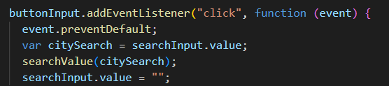
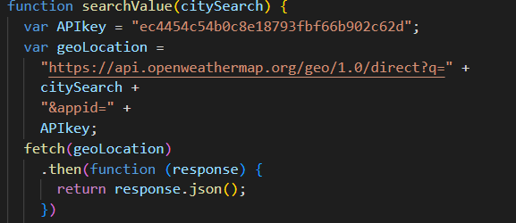
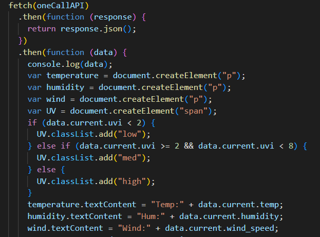
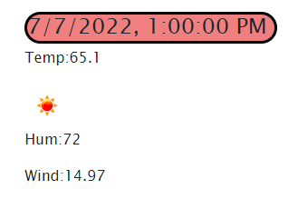

# Weather Forecaster

## Description

Here an application made to forecast the weather for the next five days in any location! I provided a link below for you to try it yourself. Enjoy.

[Weather Forecaster](https://dstefani86.github.io/weather_forecaster/)

## Installation

To install this project, locate it through my

[GitHub Profile](https://github.com/DStefani86/)

Once you have located the repository, click the clone button. Clone the SSH to your local terminal.

## Usage

For this project I used bootstrap, html, css, and JavaScript. I wanted to see how far I could take a function so instead of using a bunch of functions I tried to limit it to a few. These are a few code snippets to show you a few examples I'm proud of.

I first created an event listener to receive the search input.

Next I made a function to call my API to get the lattitude and longitude for each location and turn it into data.

I then fetched the specific attributes I wanted from the API and wrote an if loop to color code a specific one while returning the data.

Resulting in a card that looks like this.

## Contact Me!

[Email](stefanibusiness@gmail.com)
 
[LinkedIn](https://www.linkedin.com/in/daniel-stefani-b88695238/)
 

## Credits

[Discord](https://discord.gg/bAAUjZkp)

[StackOverflow](https://stackoverflow.com/)

[W3schools](www.w3schools.com)
 

## License

MIT License

Copyright (c) [2022] [Daniel Stefani]

Permission is hereby granted, free of charge, to any person obtaining a copy
of this software and associated documentation files (the "Software"), to deal
in the Software without restriction, including without limitation the rights
to use, copy, modify, merge, publish, distribute, sublicense, and/or sell
copies of the Software, and to permit persons to whom the Software is
furnished to do so, subject to the following conditions:

The above copyright notice and this permission notice shall be included in all
copies or substantial portions of the Software.

THE SOFTWARE IS PROVIDED "AS IS", WITHOUT WARRANTY OF ANY KIND, EXPRESS OR
IMPLIED, INCLUDING BUT NOT LIMITED TO THE WARRANTIES OF MERCHANTABILITY,
FITNESS FOR A PARTICULAR PURPOSE AND NONINFRINGEMENT. IN NO EVENT SHALL THE
AUTHORS OR COPYRIGHT HOLDERS BE LIABLE FOR ANY CLAIM, DAMAGES OR OTHER
LIABILITY, WHETHER IN AN ACTION OF CONTRACT, TORT OR OTHERWISE, ARISING FROM,
OUT OF OR IN CONNECTION WITH THE SOFTWARE OR THE USE OR OTHER DEALINGS IN THE
SOFTWARE.

## Thank You!!!
